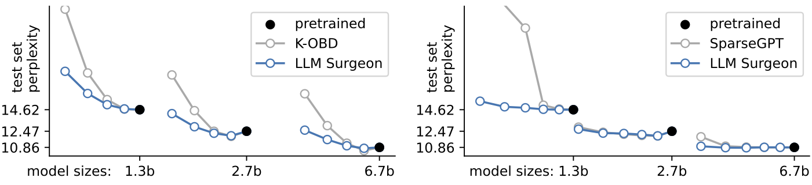
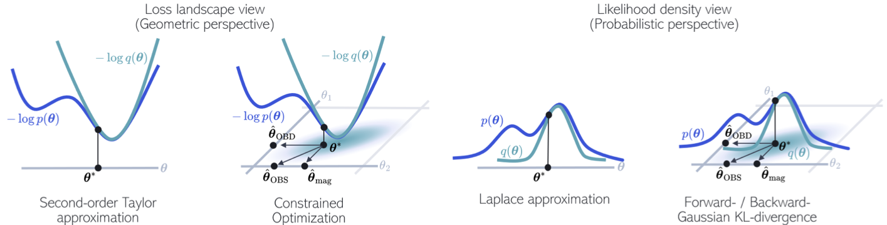

# The LLM Surgeon

## Abstract


 | 


Code for paper [The LLM Surgeon](https://arxiv.org/abs/2312.17244).
The code was based of the GitHub repo for the 2023 ICML paper [SparseGPT](https://github.com/IST-DASLab/sparsegpt) and uses the same data and evaluation pipeline for fair comparison.


State-of-the-art language models are becoming increasingly large in an effort to achieve the highest performance on large corpora of available textual data. However, the sheer size of the Transformer architectures makes it difficult to deploy models within computational, environmental or device-specific constraints. We explore data-driven compression of existing pretrained models as an alternative to training smaller models from scratch. To do so, we scale Kronecker-factored curvature approximations of the target loss landscape to large language models. In doing so, we can compute both the dynamic allocation of structures that can be removed as well as updates of remaining weights that account for the removal. We provide a general framework for unstructured, semi-structured and structured pruning and improve upon weight updates to capture more correlations between weights, while remaining computationally efficient. Experimentally, our method can prune rows and columns from a range of OPT models and Llamav2-7B by 20%-30%, with a negligible loss in performance, and achieve state-of-the-art results in unstructured and semi-structured pruning of large language models.


## Getting started

### Installation
  First, let's define the path where we want the repository to be downloaded:
  ```
  REPO_PATH=<path/to/repo>
  ```
  Now we can clone the repository:
 ```
 git clone git@github.com:Qualcomm-AI-research/<...>.git $REPO_PATH
 cd $REPO_PATH
 ```
 Next, create a virtual environment. Minimum Python version required is 3.6; this code-base has been tested with Python 3.8.1.
 ```
 python3 -m venv env
 source env/bin/activate
 pip install --upgrade --no-deps pip
 ```
 Finally, install the dependencies using pip from `requirements.txt`:
 ```
 pip install -r requirements.txt
 ```

### Getting access to the models:
- Request a Huggingface token
- On line 30 in `surgeon.py`, replace `# TODO add token here` with the Huggingface token

We are now ready to run the experiments!

# Example Usage

#### Structured LLM Surgeon
```
python surgeon.py --model_str facebook/opt-125m --sparsity 0.5 --curvature kfac --structures row column
```

#### Semi-structured LLM Surgeon
```
python surgeon.py --model_str facebook/opt-125m  --sparsity 0.5 --curvature kfac --structures 2:4 --shots 5 --use_iad --max_correlate 2000 --addupdate --damp_g 0.1
```

#### Unstructured LLM Surgeon
```
python surgeon.py --model_str facebook/opt-125m --sparsity 0.5 --curvature kfac --structures element
```

Examples of different structure types:


# Main settings

| Argument | Default | Information
| ------ | ------ | ------
| `--model_str` | `facebook/opt-125` | Default model_str
| `--sparsity` | `0.5` | Target sparsity level determines fraction of weights that are removed.
| `--curvature` | `kfac` | Type of loss curvature approximation. Choose from: `identity`, `activations` or `kfac` (recommended).
| `--structures` | `row column` | Structured `row column`, semi-structured `2:4`/`4:8`, or unstructured `element` pruning.
| `--obd` | `None` | Assume all weights are independent, ignoring off-diagonal terms. Only remove weights. (not recommended)
| `--use_iad` | `None` | Assume independence of activations and derivatives of classic KFAC. (recommended)
| `--shots` | `40` | Amount of shots in pruning schedule.
| `--fisher_samples` | `0` | Amount of samples from Fisher, or Empirical Fisher (EF) at setting `0`.
| `--max_correlate` | `0` | Maximum number of weight correlations in a layer per shot, or correlate everything at setting `0` (recommended), or correlate rows `-1`.
| `--krank` | `1` | Amount of Kronecker factors to sum in kfac curvature estimate, default is `1` (recommended).
| `--diagonal` | `None` | Also use a diagonal curvature estimate (recommended).


For a full overview of available settings, run `python surgeon.py --help` or check out `surgeon.py`.

# Reproducibility

#### Reproduce results from paper
Scripts to reproduce all results in the paper can be found in the `scripts/` directory.

In these scripts, ensure to set the `$LLAMA_V2_ROOT`, `$PROJECT_ROOT` and `$LOG_ROOT` variables, or ensure that these are set in the environment.
Alternatively, instead of setting the variable `$LOG_ROOT`, the root log directory can be passed as `--log_root` to `surgeon.py`.

#### Run other methods

Our code offers a general framework for pruning algorithms. A few examples of pruning methods:

```
# Magnitude pruning
python surgeon.py --model_str facebook/opt-125m --sparsity 0.5 --curvature identity --obd --structures row column

# L-OBD
python surgeon.py --model_str facebook/opt-125m --sparsity 0.5 --curvature activations --obd --structures row column

# Kron-OBD
python surgeon.py --model_str facebook/opt-125m --sparsity 0.5 --curvature kfac --obd --structures row column

# Structured LLM Surgeon
python surgeon.py --model_str facebook/opt-125m --sparsity 0.5 --curvature kfac --structures row column

# Unstructured LLM Surgeon
python surgeon.py --model_str facebook/opt-125m --sparsity 0.5 --curvature kfac --structures element
```

# Extendability

The codebase is designed to be easily extendable to other curvature estimates and pruning algorithms.

| File | Contains |
| ------ | ------ |
| `surgeon.py` | Main script |
| `sparsify.py` | General outer loop to prune large language model. |
| `curvature.py` | Contains curvature types inheriting `Curvature` class. |
| `pruner.py` | Contains computation of losses $\mathcal{L}$ and weight updates $\Delta \vtheta$ from curvatures. |
| `threshold.py` | Efficient implementation to compute global threshold from local layer-wise losses to match target sparsity level. Takes into account overlap between rows and columns and layer sizes. |
| `eval.py` | Code for evaluation pass |
| `lora.py` | Code for LoRA finetuning |
| `utils.py` | Contains helper functions. Most imporantly, `sub_to_full` and `full_to_sub` to only do operations on relevant sub-matrices. |
| `datautils.py` | Contains helper functions for data loading. |


# References

If you found this code useful, please be sure to cite:

```
@article{van2023llm,
  title={The LLM Surgeon},
  author={van der Ouderaa, Tycho FA and Nagel, Markus and van Baalen, Mart and Asano, Yuki M and Blankevoort, Tijmen},
  journal={arXiv preprint arXiv:2312.17244},
  year={2023}
}
```

